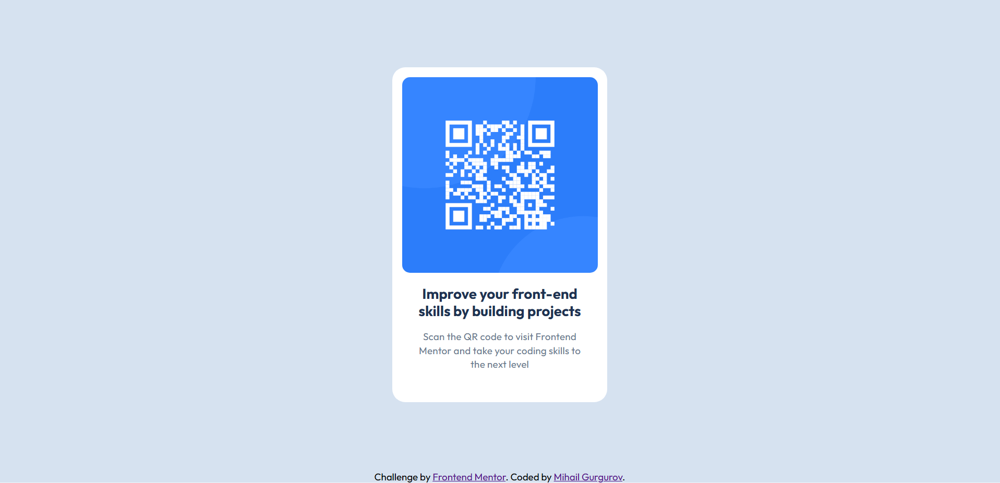

# Frontend Mentor - QR code component solution

This is a solution to the [QR code component challenge on Frontend Mentor](https://www.frontendmentor.io/challenges/qr-code-component-iux_sIO_H). Frontend Mentor challenges help you improve your coding skills by building realistic projects.

## Table of contents

-   [Overview](#overview)
    -   [Screenshot](#screenshot)
    -   [Links](#links)
-   [My process](#my-process)
    -   [Built with](#built-with)
    -   [Continued development](Continued-development)
-   [Author](#author)

## Overview

### Screenshot



### Links

-   Solution URL: [solution](https://mihasik556.github.io/QR-Code-Project/)

## My process

### Built with

-   Semantic HTML5 markup
-   CSS custom properties
-   Flexbox

### Continued development

I wrote this code for desktop devices first and after that modified it for mobile ones. After this project I\`ll try to learn more about Mobile-first Workflow. It seems to me that this technology is very useful.

## Author

-   Website - I don`t have a website for now but will in future!
-   Frontend Mentor - [@Mihasik556](https://www.frontendmentor.io/profile/Mihasik556)

## How to run the project

1. Clone the repository:

```bash
git clone https://github.com/Mihasik556/QR-Code-Project.git
```

2. Open the folder:

```bash
cd QR-Code-Project
```

3. Launch index.html in your browser:

```bash
start index.html
```

Or just open it in the folder
